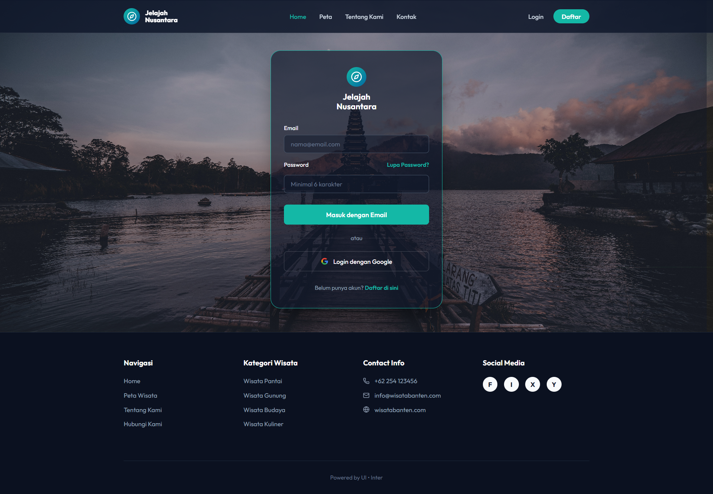
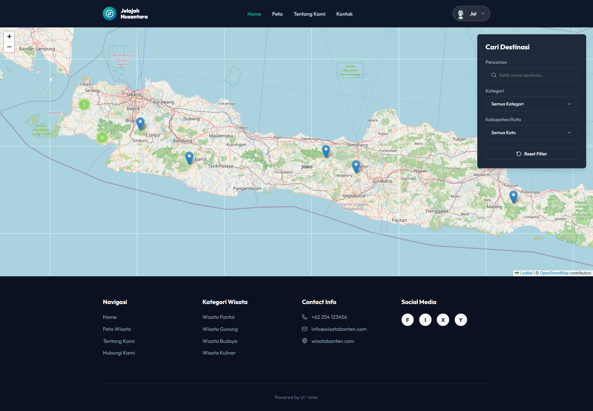
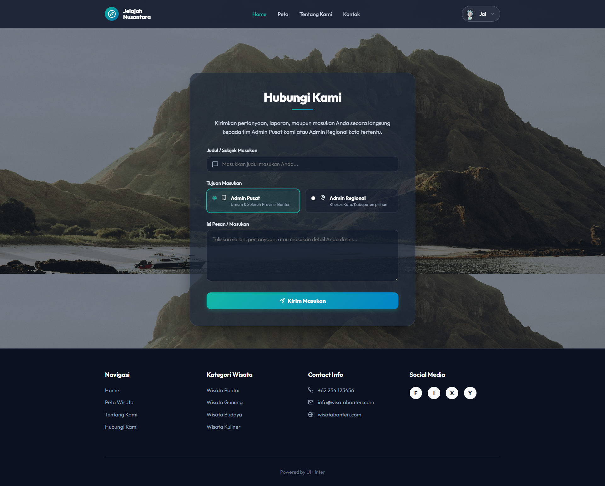

# 🏝️ Jelajah Nusantara


<p align="center">
  
  
  
  
</p>

Platform web komprehensif untuk mengeksplorasi destinasi wisata di Indonesia. Membantu wisatawan menemukan tempat menarik berdasarkan pulau, daerah, kategori, dan ulasan pengguna, sekaligus menyediakan sistem manajemen destinasi berlapis untuk Admin Regional dan Super Admin.

## 🔗 Demo
[https://jelajah-nusantara.vercel.app](https://jelajah-nusantara.vercel.app) *(Ganti dengan link asli jika berbeda)*

## ✨ Features
- **Pencarian & Filter Cerdas**: Cari wisata berdasarkan nama, kategori, pulau, kota/kabupaten, dan kisaran harga tiket secara dinamis.
- **Rekomendasi Terdekat**: Menampilkan destinasi wisata terdekat berdasarkan koordinat GPS aktual pengguna.
- **Manajemen Ulasan & Rating**: Pengguna dapat memberikan ulasan dengan teks, memberikan rating bintang, dan mengunggah foto langsung.
- **Gamifikasi "User Badges"**: Sistem lencana otomatis (Langkah Awal, Sang Pengembara, Petualang Handal, Ahli Jelajah, Pemandu Nusantara, hingga Legenda Penjelajah) berdasarkan keaktifan pengguna menulis ulasan.
- **Manajemen Profil & Foto**: Pengguna dapat memperbarui informasi pribadi dan mengubah foto profil langsung yang akan ditampilkan pada setiap ulasan mereka.
- **Layanan Kontak & Masukan**: Halaman pengiriman keluhan atau saran langsung bagi pengguna terautentikasi untuk ditinjau oleh Admin.
- **Pemulihan Akun (Forgot & Update Password)**: Alur pemulihan kata sandi yang aman dan terintegrasi otomatis dengan email melalui Supabase Auth.
- **Sistem Role Bertingkat**: Pembagian hak akses yang jelas antara `Visitor`, `User`, `Regional Admin`, dan `Super Admin`.
- **Pengajuan Data (Proposals)**: Mekanisme pengajuan daerah atau kategori wisata baru oleh Regional Admin untuk disetujui Super Admin sebelum tampil ke publik.
- **Integrasi Peta**: Navigasi dan visualisasi lokasi presisi destinasi menggunakan peta interaktif.
- **Keamanan & RLS Terjamin**: Perlindungan dari manipulasi hak akses ilegal menggunakan PostgreSQL Triggers dan pengunggahan gambar aman via Server-Side API.

## 🛠️ Tech Stack
| Bagian | Teknologi |
| ------ | ------ |
| **Frontend Framework** | Next.js (App Router), React |
| **Bahasa Pemrograman** | TypeScript |
| **Styling** | Vanilla CSS (Custom Properties) |
| **Database & Auth** | Supabase (PostgreSQL) |
| **Image Hosting** | ImgBB |
| **Deployment** | Vercel |

## 📸 Screenshots
<p align="center">
  
  
</p>
<p align="center">
  
  
  
  
</p>

## 🚀 Installation

Ikuti langkah-langkah di bawah ini untuk menjalankan project secara lokal:

**1. Clone Repository**
```bash
git clone https://github.com/YotaGod/JelajahNusantara.git
cd JelajahNusantara
```

**2. Install Dependencies**
```bash
npm install
```

**3. Setup Environment Variables**
Buat file `.env.local` di *root* direktori dan sesuaikan isinya:
```bash
cp .env.example .env.local
```

**4. Run Development Server**
```bash
npm run dev
```
Buka [http://localhost:3000](http://localhost:3000) di browser untuk melihat hasilnya.

## 🔐 Environment Variables

Contoh file `.env.example`:

```env
# Supabase Configuration
NEXT_PUBLIC_SUPABASE_URL=https://your-project-id.supabase.co
NEXT_PUBLIC_SUPABASE_ANON_KEY=your-anon-key

# ImgBB Configuration
NEXT_PUBLIC_IMGBB_API_KEY=your-imgbb-api-key
```

## 📂 Project Structure

```text
JelajahNusantara/
├── src/
│   ├── app/                # Next.js App Router (Pages & Layouts)
│   │   ├── admin/          # Admin Dashboard (Users, Proposals, Destinations)
│   │   ├── auth/           # Authentication Callbacks
│   │   ├── destinations/   # Destination detail pages
│   │   └── ...
│   ├── components/         # Reusable React Components
│   ├── lib/                # API Functions & Helpers (Supabase Queries)
│   └── utils/              # Utilities (e.g. Supabase client config)
├── public/                 # Static assets (images, icons)
├── .env.example            # Environment variables template
├── next.config.mjs         # Next.js configuration
├── package.json            # Project dependencies and scripts
└── README.md               # Project documentation
```

## 📜 Available Scripts

- `npm run dev`: Menjalankan *development server* di `localhost:3000`.
- `npm run build`: Melakukan *build* aplikasi untuk versi produksi.
- `npm run start`: Menjalankan aplikasi versi *production* yang sudah di-build.
- `npm run lint`: Mengecek *error* pada kode dengan ESLint.

## ☁️ Deployment

Proyek ini telah dikonfigurasi agar sangat mudah di-*deploy* ke [Vercel](https://vercel.com/):

1. *Push* kode ke repositori GitHub.
2. Buat proyek baru di Vercel dan hubungkan dengan repositori tersebut.
3. Masukkan `Environment Variables` yang dibutuhkan (Supabase URL & Key, ImgBB API Key) di pengaturan Vercel.
4. Klik **Deploy**. Vercel akan otomatis melakukan *build* setiap kali ada *commit* baru di *branch* utama.

## 🤝 Contributing

Kontribusi selalu diterima! Jika Anda ingin menambahkan fitur baru atau memperbaiki *bug*, silakan:
1. *Fork* repositori ini
2. Buat *branch* baru (`git checkout -b feature/AmazingFeature`)
3. *Commit* perubahan Anda (`git commit -m 'Add some AmazingFeature'`)
4. *Push* ke *branch* (`git push origin feature/AmazingFeature`)
5. Buka sebuah *Pull Request*

## 📄 License

Didistribusikan di bawah **MIT License**. Lihat `LICENSE` untuk informasi lebih lanjut.

## 👨‍💻 Author

**Jelajah Nusantara Team**
- GitHub: [@YotaGod](https://github.com/YotaGod)
