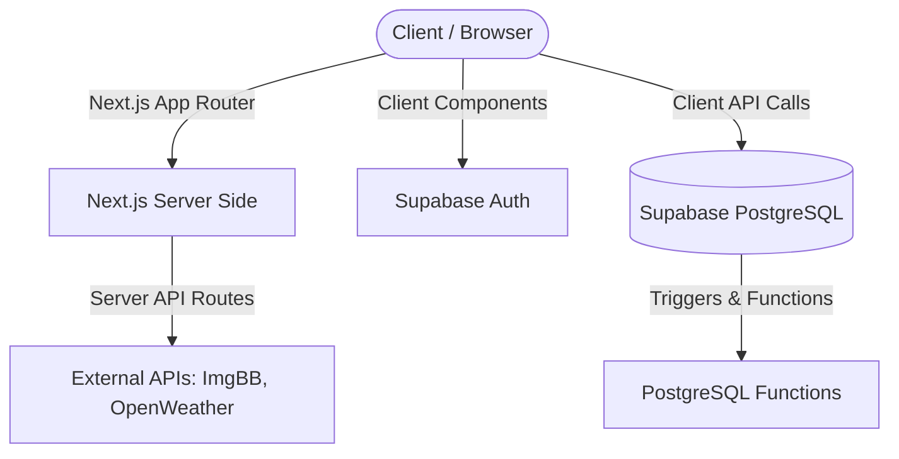
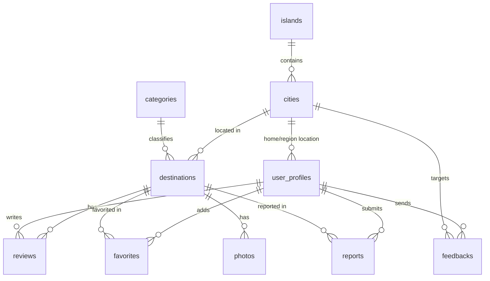

# System Architecture - Jelajah Nusantara

This document outlines the architecture, data flow, security mechanisms, and deployment layout of the Jelajah Nusantara platform.

---

## 1. System Overview

Jelajah Nusantara is built on a modern hybrid architecture combining Next.js App Router for frontend/backend capabilities and Supabase for real-time relational database, authentication, and granular access control policies.



---

## 2. Authentication & Authorization Flow

### Authentication Flow
We utilize Supabase Auth with PKCE flow in Next.js.
1. The user logs in via email/password or OAuth (Google).
2. The user session is managed securely via HTTP-only cookies in `@supabase/ssr`.
3. Account recovery (Forgot & Update Password) utilizes Supabase Auth email templates redirecting back to `/update-password`.

### Authorization Flow (Role Management)
Granular access control is enforced at the database level using Row Level Security (RLS).

```mermaid
sequenceDiagram
    participant User as Client
    participant API as Supabase REST API
    participant DB as PostgreSQL (RLS)
    
    User->>API: Fetch Destinations / Proposals
    API->>DB: Check auth.uid() & user_profiles.role
    alt Is Super Admin
        DB-->>User: Grant full access (Read, Write, Update, Delete)
    alt Is Regional Admin
        DB-->>User: Grant write access to own region only
    alt Is Standard User
        DB-->>User: Grant write access to own reviews/favorites only
    alt Visitor
        DB-->>User: Read-only access to approved public items
    end
```

---

## 3. Database Schema

The database relies on a PostgreSQL schema with several security triggers to maintain data integrity and prevent unauthorized modifications to critical columns (such as `role` and report status).



---

## 4. API Communication

### Internal Endpoints
- `/api/upload`: Server-side proxy routing to ImgBB API to prevent leak of `IMGBB_API_KEY`.
- `/api/weather`: Fetches weather conditions and 5-day forecasts from OpenWeatherMap.
- `/auth/callback`: Handles PKCE oauth code exchange.

### Supabase Database Access
Direct REST API communications from Client Components utilizing `@/utils/supabase/client` or Server Actions utilizing `@/utils/supabase/server`. All calls are fully secured via Supabase RLS.

---

## 5. Deployment Architecture

The system is deployed on a fully serverless environment:
- **Frontend & API Routes**: Vercel (Continuous Deployment from GitHub branch `main`).
- **Database & Auth**: Supabase Cloud (hosted on AWS).
- **Background Cron Jobs**: GitHub Actions runner executing daily pings to keep Supabase free-tier database awake via mock write commands.
